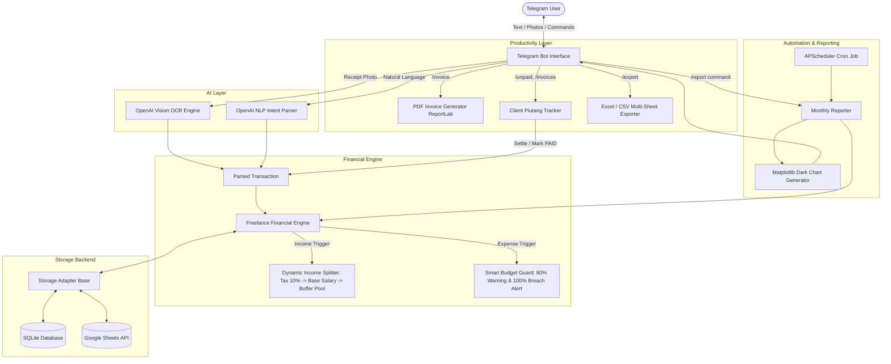

# 🚀 Freelance AI Financial Engine

> **A production-ready, free-to-deploy backend & Telegram AI Bot designed specifically for freelancers with fluctuating monthly incomes.**
> Features automated receipt Vision OCR, dynamic income smoothing, smart budget guardrails (80% warning & 100%+ breach alerts), PDF Invoice generation, client piutang tracking with WhatsApp reminder drafts, and 1-click Excel multi-sheet export.

---

## 🌟 Features Overview

1. 🧾 **PDF Invoice Generator (`/invoice`):** Create professional, minimalist PDF invoices on the fly directly in Telegram with custom branding, bank/payment details, unique invoice IDs, and due dates.
2. ⏰ **Client Piutang & Payment Due Tracker (`/unpaid`):** 
   - Track unpaid client invoices with countdown badges (`🟢 H-7`, `🟡 Due Today`, `🔴 Overdue`).
   - Generate polite, ready-to-copy WhatsApp/Email follow-up drafts (`/remind_invoice <ID>`).
   - **Automated Settlement Flow (`/pay_invoice <ID>`):** When marked as paid, funds **automatically route into the Income Smoothing engine** (reserving 10% tax, filling base salary floor, and depositing surplus into the Buffer Fund).
3. 📥 **1-Click Multi-Sheet Excel Export (`/export`):** Instantly export your financial data into a formatted `.xlsx` workbook containing 3 sheets: *Ringkasan Finansial*, *Histori Transaksi*, and *Daftar Invoice*.
4. 💸 **Dynamic Income Smoothing:** Automatically reserves Tax/Operational funds (10%), fulfills your baseline living salary floor, and funnels **all surplus into a Buffer Fund / Smoothing Pool**.
5. 🛡️ **Income Drawdowns (`/draw_buffer`):** In lean/dry months with zero revenue, draw living expenses directly from your Buffer Pool to keep personal cashflow constant.
6. 📸 **AI Vision OCR (`gpt-4o` / `gpt-4o-mini`):** Snap a receipt photo; AI extracts merchant, amount, date, and category automatically with an interactive confirmation card.
7. 💬 **Conversational NLP:** Record income or expenses naturally in Indonesian or English (e.g., `"Masuk fee klien project web 5jt"` or `"Beli kopi starbucks 45rb"`).
8. 🚨 **Smart Budget Guardrails:** 
   - **80% Warning:** Alerts you with safe remaining quota.
   - **100%+ Breach Alert:** Warns that subsequent expenses will directly erode your emergency/buffer savings.
9. 📊 **Visual Monthly Reports:** Generates comprehensive Markdown summaries and Matplotlib dark-mode charts sent automatically on the last day of the month or on-demand via `/report`.
10. 💾 **Hybrid Storage:** Works out-of-the-box with **SQLite** (zero setup) and seamlessly connects to **Google Sheets API** for collaborative cloud spreadsheets.

---

## 🏗️ System Architecture



---

## 📂 Project Structure

```
keungan/
├── ai/
│   ├── __init__.py
│   ├── ocr_vision.py          # OpenAI Vision receipt OCR extractor
│   └── nlp_parser.py          # Natural language expense & income parser
├── bot/
│   ├── __init__.py
│   ├── handlers.py            # Commands, text messages, photo, callback queries
│   ├── keyboards.py           # Inline confirmation and category picker keyboards
│   └── middleware.py          # User ID whitelist security & global error handler
├── database/
│   ├── __init__.py            # Storage factory
│   ├── base.py                # Abstract StorageBackend interface
│   ├── models.py              # Pydantic schemas & enums (Transaction, Invoice, UserSettings)
│   ├── sqlite_db.py           # aiosqlite asynchronous database implementation
│   └── gsheets_db.py          # Google Sheets (gspread) cloud implementation
├── engine/
│   ├── __init__.py
│   ├── financial_engine.py    # Income smoothing, tax reserve, buffer fund logic
│   └── rules.py               # Financial rules and guardrail thresholds (80%, 100%)
├── invoice/
│   ├── __init__.py
│   ├── invoice_generator.py   # ReportLab modern PDF invoice builder
│   ├── invoice_parser.py      # Parser for conversational invoice syntax
│   └── tracker.py             # Client piutang tracking & payment settlement flow
├── reporter/
│   ├── __init__.py
│   ├── monthly_report.py      # Markdown report & financial health compiler
│   └── chart_generator.py     # Matplotlib dark-mode chart renderer
├── tools/
│   ├── __init__.py
│   └── exporter.py            # 1-Click Multi-Sheet Excel exporter (.xlsx)
├── tests/
│   ├── test_bot_setup.py      # Bot builder & handler verification
│   ├── test_database.py       # SQLite CRUD & aggregation tests
│   ├── test_engine.py         # Income splitting & budget guard tests
│   ├── test_exporter.py       # Excel .xlsx export tests
│   ├── test_health_and_formatting.py # Runway & currency format tests
│   ├── test_invoice.py        # PDF invoice generation & parser tests
│   ├── test_nlp_ocr.py        # AI parsing & heuristic regex tests
│   ├── test_piutang_settlement.py # Settle invoice payment integration tests
│   └── test_reporter.py       # Report & chart generator tests
├── config.py                  # Pydantic Settings configuration
├── main.py                    # Application entrypoint & APScheduler
├── requirements.txt           # Python dependencies
├── Dockerfile                 # Production Docker container
├── docker-compose.yml         # Container orchestration
├── .env.example               # Environment variables template
└── README.md                  # System documentation
```

---

## ⚡ Quick Start & Local Setup

### 1. Prerequisites
- Python 3.10+ installed
- Telegram Bot Token (from [@BotFather](https://t.me/BotFather))
- OpenAI API Key (from [OpenAI Platform](https://platform.openai.com/api-keys))

### 2. Install Dependencies
```bash
# Create and activate virtual environment
python -m venv venv
# Windows:
venv\Scripts\activate
# Linux/macOS:
source venv/bin/activate

# Install dependencies
pip install -r requirements.txt
```

### 3. Configure Environment Variables
Copy `.env.example` to `.env`:
```bash
cp .env.example .env
```
Edit `.env` and fill in your keys:
```env
TELEGRAM_BOT_TOKEN=123456789:ABCdefGhIJKlmNoPQRsTUVwxyZ
OPENAI_API_KEY=sk-proj-your_openai_api_key_here
OPENAI_MODEL=gpt-4o-mini
DB_BACKEND=sqlite
SQLITE_DB_PATH=data/freelance_finance.db

# Optional: Restrict bot usage to your Telegram User ID
ALLOWED_TELEGRAM_USER_IDS=
```

### 4. Run the Bot
```bash
python main.py
```
Open Telegram, search for your bot, and type `/start`!

---

## 💬 Bot Commands & Interactions

### Commands List
| Command | Description |
| :--- | :--- |
| `/start` | Launch bot onboarding & show interactive quick menu |
| `/invoice` | Generate professional PDF invoice & log to piutang table |
| `/unpaid` or `/invoices` | View all pending unpaid client invoices & due dates |
| `/pay_invoice <ID>` | Mark invoice as PAID & automatically trigger Income Smoothing |
| `/remind_invoice <ID>` | Generate polite WhatsApp/Email follow-up draft |
| `/export` | 1-Click download of `.xlsx` Excel financial workbook |
| `/status` | View current month's budget status, salary drawn, and buffer runway |
| `/report` | Generate comprehensive financial report + Matplotlib visual chart |
| `/buffer` | View Buffer Fund balance, runway in months, and smoothing details |
| `/draw_buffer [amount]` | Draw living costs from Buffer Fund during lean months |
| `/history` | View latest 10 transactions |
| `/settings` | View and update Target Salary, Tax %, Category Budgets, Bank Info |
| `/set_name <nama>` | Update your freelancer name on PDF invoices |
| `/set_bank <info bank>` | Update payment account details on PDF invoices |
| `/set_salary <amount>` | Update target monthly living salary |
| `/set_tax <percentage>` | Update tax/operational reserve percentage (e.g., `10` or `12`) |
| `/set_needs <amount>` | Update monthly Needs budget limit |
| `/set_wants <amount>` | Update monthly Wants budget limit |
| `/set_ops <amount>` | Update monthly Operational budget limit |
| `/help` | Detailed instructions and examples |

---

## 🧪 Automated Testing

Run the comprehensive pytest suite:
```bash
python -m pytest tests/ -v
```

All 17 unit tests verify:
- PDF invoice generation & parser formatting
- Client piutang tracking & settlement flow into Income Smoothing
- Multi-sheet `.xlsx` Excel export with tabular formatting
- Dynamic income splitting math & surplus routing
- Smart budget guardrail threshold triggers (80% & 100%+)
- Buffer drawdown during lean months
- AI NLP heuristic & OpenAI fallback schemas
- Receipt Vision OCR extraction schema
- SQLite database CRUD & monthly aggregation
- Matplotlib chart generation & byte formatting

---

## 🚀 Free Deployment Guide

### Option 1: Render (Free Background Worker)
1. Push your repository to GitHub.
2. Log in to [Render](https://render.com) and create a **New Background Worker**.
3. Select your repository, choose **Python 3** environment.
4. Set Build Command: `pip install -r requirements.txt`
5. Set Start Command: `python main.py`
6. Add Environment Variables from `.env` in the Render dashboard.

### Option 2: Railway
1. Create a project on [Railway](https://railway.app).
2. Connect your GitHub repository.
3. Add Environment Variables in the Railway Dashboard.
4. Deploy!

### Option 3: Docker / VPS
```bash
# Build and run with docker-compose
docker-compose up -d --build
```

---

## 📜 License
MIT License. Built for freelancers, digital nomads, and independent creators worldwide.
